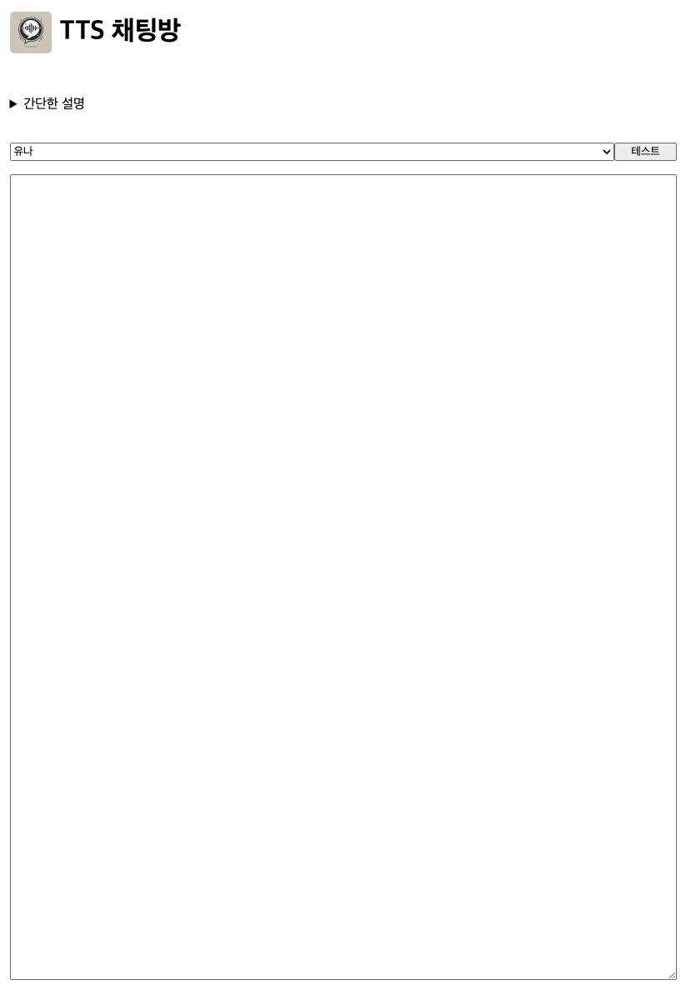
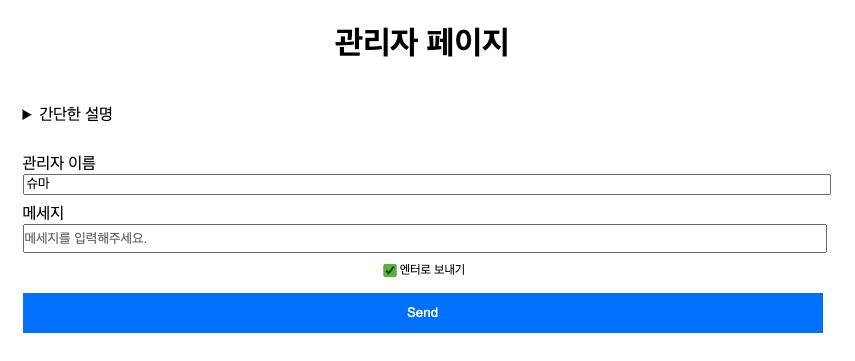

# 실시간 TTS 채팅

## 페이지 구성

### 1. 채팅방

채팅방에서는 사용자들이 접속해서 채팅을 받습니다. 관리자 외에 채팅을 보낼을 순 없습니다.\
채팅이 오면 자동으로 TTS가 채팅을 읽어줍니다.

<!--  -->

### 2. 관리자방

관리자방에서는 채팅을 보낼 수 있다. 어떤 관리자가 채팅을 보내는지 구분하기 위해서 닉네임을 사용한다.\
관리자가 보낸 채팅은 모두에게 발송되며 즉시 TTS 읽어주게 된다.

---

## 구현

### 1. SSE

실시간 채팅은 SSE로 구현했다. 페이지 진입 시 SSE 연결시키고 서버에서 `EventEmitter`를 이용하여 새로운 채팅이 발생하면 클라이언트에게 전달한다.

`/chat/sse` 라우터로 연결한다.
`/chat/send` 라우터로 sse를 발송한다.

### 2. 메세지 핸들링 싱글턴

새로운 유저도 접속했을 때, 이전의 메세지를 볼 수 있도록 메세지를 싱글턴 클래스에 저장해둔다. 페이지를 요청하면 여태까지 쌓인 메세지를 `SSR`로 랜더링하며 가져온다.

---

## 직접 해보기

### 1. 일반 유저

사실 할 수 있는건 없지만 여기로 접속하면 된다. \
https://tts-chat-six.vercel.app/ \

### 2. 관리자

여기에 접속해서 해보도록 하자.\
https://tts-chat-six.vercel.app/admin \
관리자 비밀번호는 `shuma`이다.